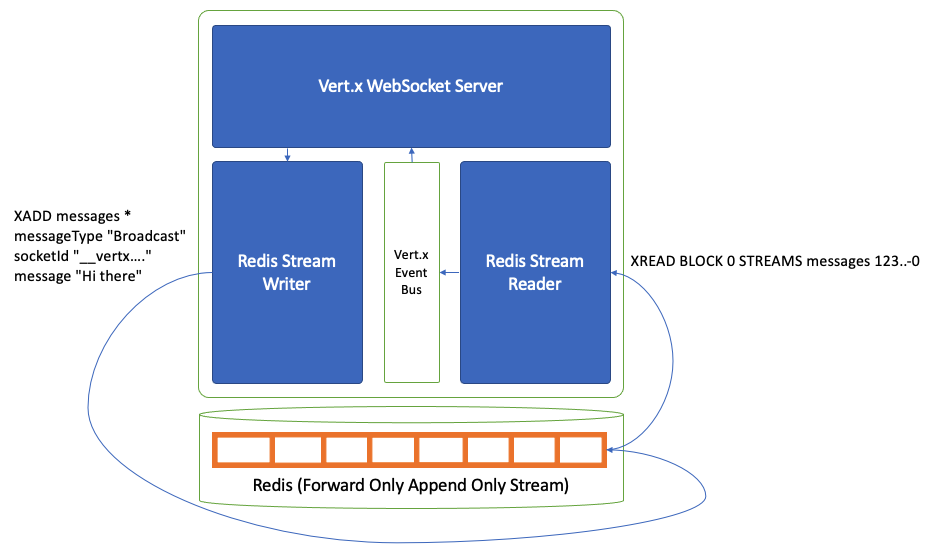

# redis-vertx-chat
A Redis Streams backed chat server using Vert.x for the WebSocket server and local message bus.

## Overview
This Java service demonstrates some implementation ideas for using Vert.x and Redis '[Stream](https://redis.io/topics/streams-intro)' data type to implement a push-messaging server.

The basic concept as illustrated below is to:
1) Accept WebSocket connections using Vert.x
2) Subscribe the WebSocket handler function as a consumer of messages from the  [Vert.x Event Bus](https://vertx.io/docs/apidocs/io/vertx/core/eventbus/EventBus.html)
3) Start a background thread named 'Redis Stream Reader' which performs a blocking read (in a while(true) loop) on the Redis Stream. When messages are read, they are pushed to the Vert.x Event Bus to be consumed by the WebSocket handler.
4) When messages are sent by a WebSocket, write them to Redis Streams using a separate connection 'Redis Stream Writer'

### Performance and Scalability Considerations

#### Clusterability
Using this model allows 'n' number of push messaging servers to be scaled horizontally to support as many connections as needed.

#### Write Performance
Because of the forward-only append-only nature of the Redis Stream data model, writes are exceedingly fast.

#### Read Performance
Because there is just one Redis Stream Reader instance reading the messages from the head of the stream per instance of the push messaging server, load on the Redis server(s) will be minimal and the solution should scale well.

### Reliability and Consistency

#### Catching up after a Network Dropout
Networks are intermittently available, and WebSockets need to drop out and reconnect from time to time.  

If it is important to the client to recover any messages they may have missed, it is possible to add an API to the Vert.x server which performs an XRANGE query to retrieve records for the last 'n' seconds.

It is strongly recommended to limit the time period (and maximum messages queried) for this activity, since it would heavily impact the Redis database if used too liberally, too often or with too large a time range.

In the demo we implement this using the API '/getMessagesSince.json' and in the browser we use localStorage to store the Redis ID to fetch updates from. Limits are imposed to only fetch records if the reconnection is within 1 minute. Depending on the number of messages and frequency of this kind of activity, this could be adjusted down to keep the load reasonable. 

See the local storage use in the browser here: [index.js](src/main/resources/webroot/index.js)  
And the API implementation here: [RedisChat.java](src/main/java/com/mycodefu/RedisChat.java)

